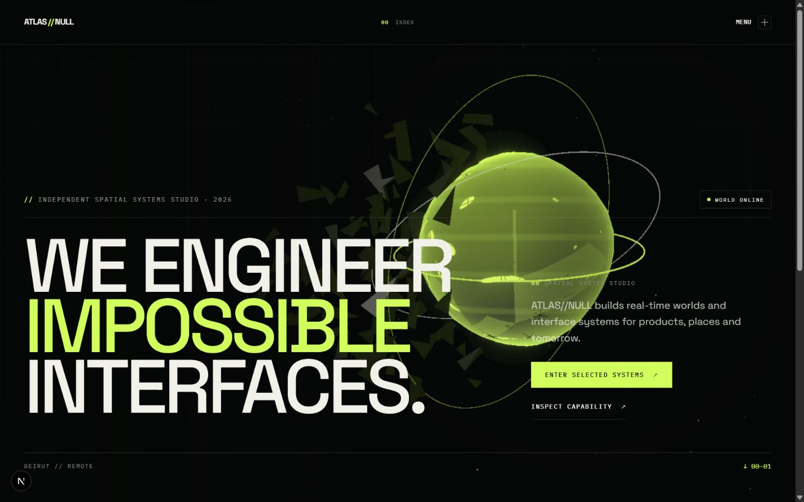
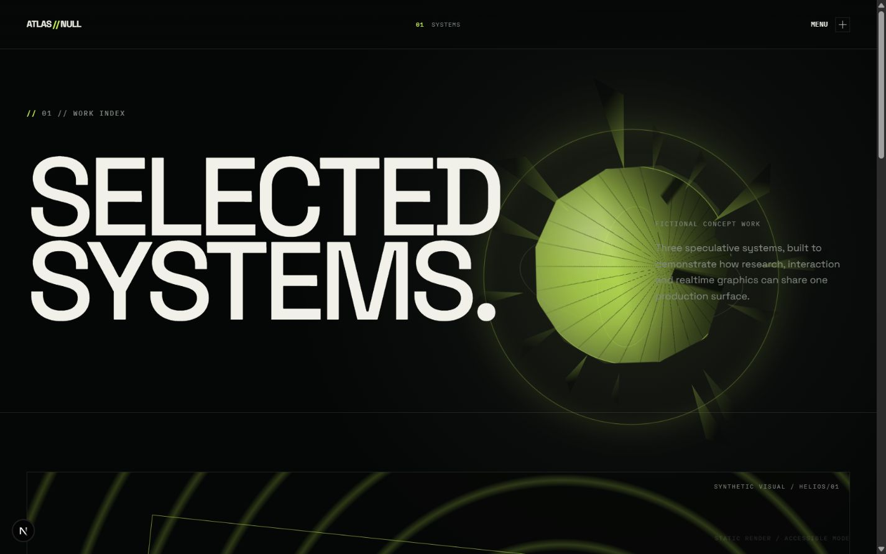
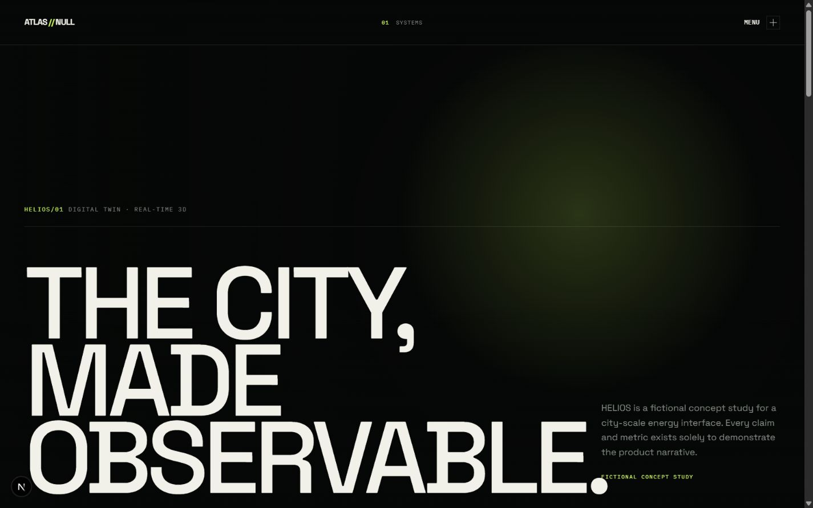

<div align="center">

# ATLAS//NULL

### Production-grade spatial systems showcase

A cinematic, multi-route digital experience built to demonstrate how expressive interaction design, realtime 3D, accessibility, and maintainable frontend architecture can live in one production surface.

[](https://github.com/Elia-Youssef/atlas-null-spatial-showcase/actions/workflows/ci.yml)
[](https://nextjs.org/)
[](https://www.typescriptlang.org/)
[](https://r3f.docs.pmnd.rs/)

[View the live experience](https://elia-youssef.github.io/atlas-null-spatial-showcase/) · [Explore the component laboratory](https://elia-youssef.github.io/atlas-null-spatial-showcase/system/)

</div>



## The concept

ATLAS//NULL is a fictional independent studio that engineers spatial interfaces for products, places, and imagined futures. The site is a deliberately ambitious portfolio piece: it replaces stock assets with a persistent procedural world, treats route changes as physical page-stack events, and keeps every client-facing surface functional when motion or WebGL is unavailable.

All projects, organizations, metrics, and testimonials in the experience are fictional. The transmission console is a local demonstration and never sends user data.

## What this project demonstrates

- A persistent React Three Fiber world that morphs between typed scene presets as the route changes.
- Cinematic stacked-page transitions with focus restoration, page-title announcements, navigation recovery, and reduced-motion behavior.
- Shader-deformed geometry, instanced shards, orbital systems, selective bloom, procedural lighting, and deterministic scene generation—with no external imagery, textures, or HDRIs.
- A deliberate public component API built from named exports, strict contracts, documented barrels, and injectable adapters.
- Progressive quality tiers for desktop GPU rendering, constrained devices, save-data preferences, coarse pointers, WebGL failure, and static rendering.
- A seven-route product narrative, including an unlisted component laboratory that documents supported states and accessibility expectations.

<table>
  <tr>
    <td width="50%">
      
    </td>
    <td width="50%">
      
    </td>
  </tr>
  <tr>
    <td align="center"><strong>Selected systems</strong></td>
    <td align="center"><strong>HELIOS/01 case study</strong></td>
  </tr>
</table>

## Experience map

| Route            | Experience                                                         |
| ---------------- | ------------------------------------------------------------------ |
| `/`              | Procedural hero and primary studio proofs                          |
| `/work/`         | HELIOS, KINETIC, and ECHO project systems                          |
| `/work/helios/`  | Scroll-directed cinematic case study                               |
| `/capabilities/` | Interactive capability and orbital-system index                    |
| `/studio/`       | Manifesto and Decode / Model / Orchestrate / Ship process          |
| `/contact/`      | Demo-only transmission console with an injected submission adapter |
| `/system/`       | Unlisted, `noindex` production component laboratory                |

## Engineering approach

The application uses Next.js App Router, React 19, strict TypeScript, Motion, Tailwind CSS, Three.js, React Three Fiber, and Drei. One world canvas is mounted in the root shell while semantic route content remains above it in the document. Scene state, rendering components, shaders, content models, transitions, form adapters, and quality policy are intentionally separate.

```text
src/
  app/          routes, metadata, static export files, and global tokens
  components/   UI, motion, navigation, world, and form systems
  features/     typed route-level compositions
  content/      fictional projects, capabilities, navigation, and copy
  lib/          pure validation, routing, quality, and scene helpers
  types/        shared public contracts
tests/
  unit/         component, state-machine, utility, and API contracts
  e2e/          navigation, accessibility, resilience, and export checks
```

Dependencies flow through deliberate `index.ts` public surfaces. Cross-feature deep imports are prohibited, named exports are used everywhere except framework-required route defaults, and complex behavior is expressed through readable controllers and state machines.

## Public API

Supported imports use the `@/` alias and documented barrels:

```ts
import { Button, Reveal, SpatialCard, WorldCanvas } from "@/components";
import { ContactConsole } from "@/features/contact";
import { getScenePreset, resolveQualityTier } from "@/lib";
import type { ScenePreset, TransitionController } from "@/types";
```

The `/system/` route is the executable reference for component variants, sizes, callbacks, disabled and loading behavior, keyboard expectations, reduced-motion handling, scene quality tiers, form outcomes, and supported import paths.

## Accessibility and resilience

- Semantic landmarks, logical heading order, skip navigation, visible focus states, and minimum touch targets.
- Keyboard and touch equivalents for interactions that enhance pointer input.
- Polite route announcements and focus transfer to the new page after navigation.
- Full, lite, and static render policies selected from device capability and user preference.
- Watchdog recovery for interrupted transitions, WebGL initialization failure, and context loss.
- Meaningful server-rendered content before the effects bundle initializes or when JavaScript enhancement fails.

## Run locally

Node.js 22 or newer and npm are required.

```bash
git clone https://github.com/Elia-Youssef/atlas-null-spatial-showcase.git
cd atlas-null-spatial-showcase
npm ci
npm run dev
```

Open [http://localhost:3000](http://localhost:3000).

```bash
npm run check       # formatting, lint, strict types, unit tests, and production build
npm run test:e2e    # Playwright route and accessibility suite
npm run test:watch  # interactive unit-test runner
```

The current local suite contains 28 unit and contract tests. Browser checks fail on serious axe violations, console or hydration errors, broken internal links, remote visual requests, and horizontal overflow.

## Static delivery

The production build exports every route to `out/`. GitHub Actions validates the project from the committed lockfile, then the Pages workflow builds with the repository base path and deploys the static artifact from `main`.

```bash
NEXT_PUBLIC_BASE_PATH=/atlas-null-spatial-showcase
NEXT_PUBLIC_SITE_URL=https://elia-youssef.github.io/atlas-null-spatial-showcase
npm run build
```

For implementation constraints and future contributor context, see [`AGENTS.md`](AGENTS.md) and [`docs/PROJECT_HANDOFF.md`](docs/PROJECT_HANDOFF.md).

---

<div align="center">
  <sub>Designed and engineered as a fictional production showcase. No external visual assets. No real data transmission.</sub>
</div>
